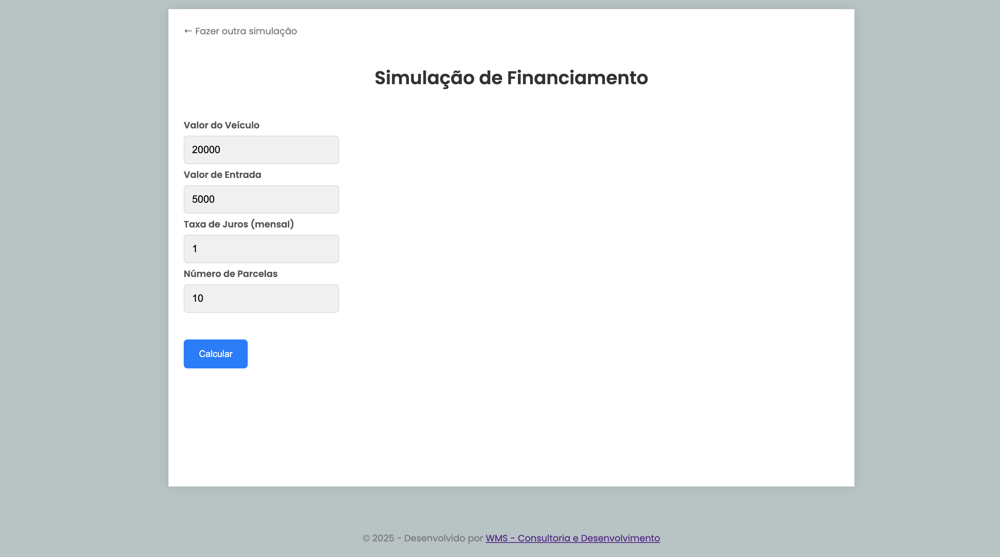
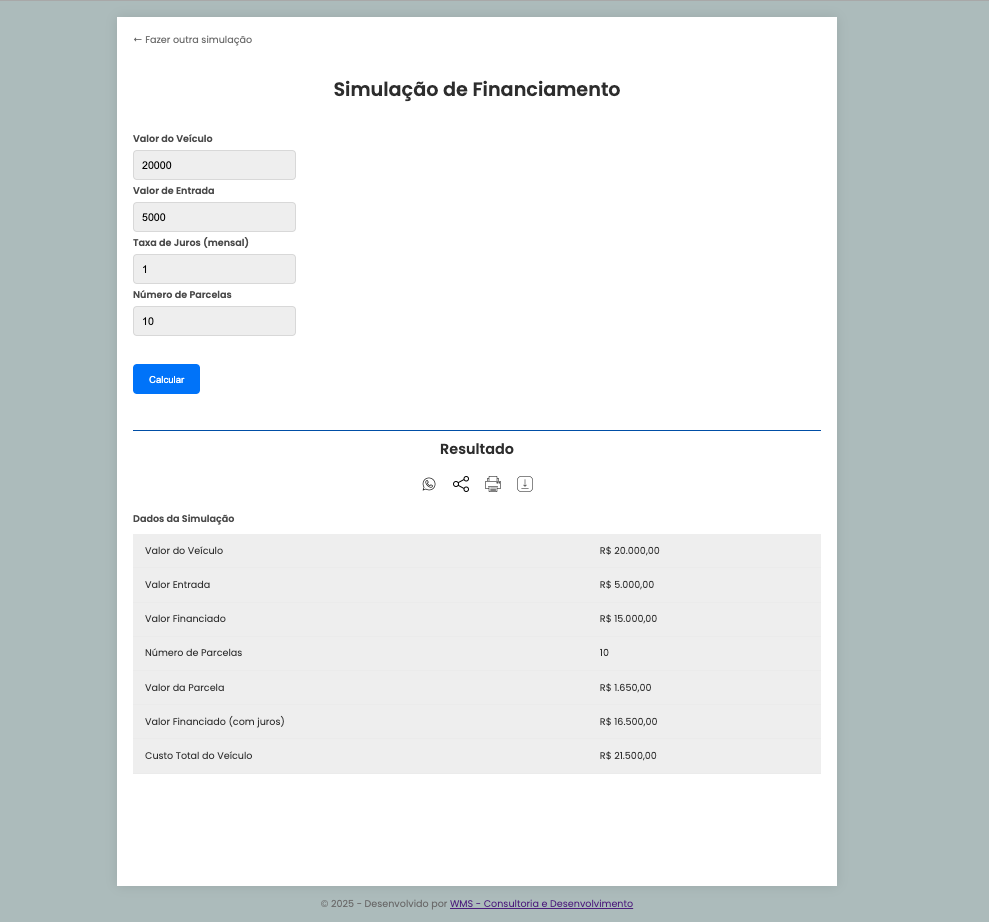

# calcula-financiamento

## 🚧 Projeto de Calculadora de Financiamento

- ≓ Imagens

1 - Tela Inicial 
<br>
2 - Tela Inicial com os dados digitados 
<br>
3 - Tela com o RESULTADO 
<br>

###

- 🚀 Para clonar o projeto:
- [Clone do projeto](https://github.com/cabraldasilvac/calcula-financiamento)

```BASH
git clone https://github.com/cabraldasilvac/calcula-financiamento
```

<br>

- ⚙️ Tecnologias usadas:
- ✓ HTML
- ✓ CSS
- ✓ JavaScript

###

- ✅ Links

  - [Linkedin](https://www.linkedin.com/in/cabraldasilvac/)
